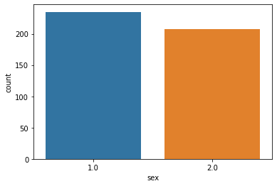
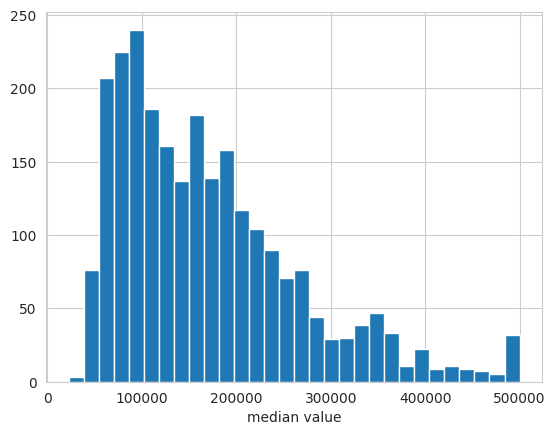
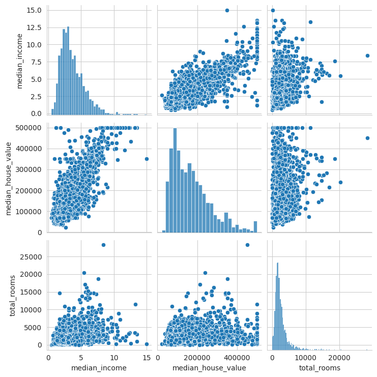
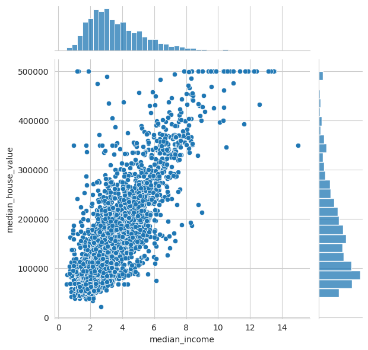
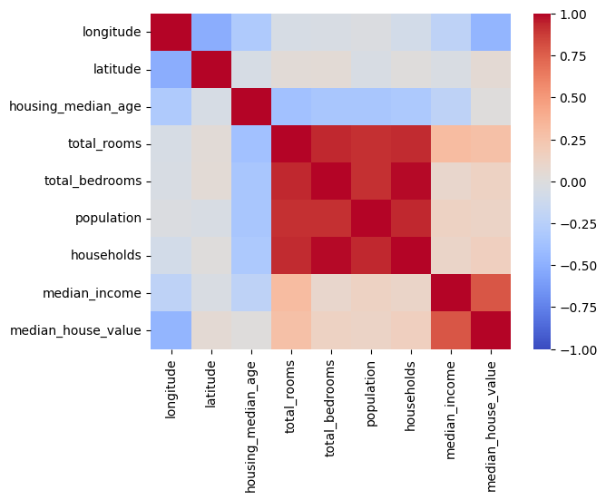
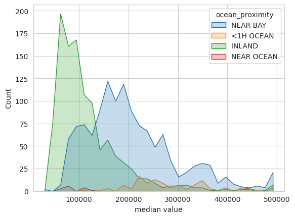

```{r, include=FALSE}
knitr::opts_chunk$set(
  python.reticulate = FALSE
)
```

------------------------------------------------------------------------

# Data: Representation, Analysis & Processing

## Similarity and Distance Measures

Choosing the right distance measures is important for achieving good
results in statistics, predictions and clusterings.

### Metrics

For a distance measure to be called a metric $d$, the following criteria
need to be fulfilled:

-   Positivity: $d(x_1,x_2)≥0$

-   $d(x_1,x_2)=0 \text{ if and only if } x_1 = x_2$

-   Symmetry: $d(x_1, x_2) = d(x_2, x_1)$

-   Triangle inequality: $d(x_1, x_3) ≤ d(x_1, x_2) + d(x_2, x_3)$

There may be distance measures that do not fulfill these criteria, but
those are not metrics.

### Similarity measures on vectors

These measures are used in many objective functions to compare data
points.

``` python
from sklearn.metrics import pairwise_distances
X1 = np.array([[2,3]])
X2 = np.array([[2,4]])
pairwise_distances(X1,X2, metric="manhattan")
```

The available metrics in sklearn are: 'cityblock', 'cosine',
'euclidean', 'l1', 'l2', 'manhattan', and from scipy: 'braycurtis',
'canberra', 'chebyshev', 'correlation', 'dice', 'hamming', 'jaccard',
'kulsinski', 'mahalanobis', 'minkowski', 'rogerstanimoto', 'russellrao',
'seuclidean', 'sokalmichener', 'sokalsneath', 'sqeuclidean', 'yule'\
More info:
[scikit-learn.org](https://scikit-learn.org/stable/modules/generated/sklearn.metrics.pairwise_distances.html)

#### Manhattan distance

The distance is the sum of the absolute differences of the components
(single coordinates) of the two points:
$$d(A, B) = \sum_{i=1}^d | A_i - B_i |$$

More info at
[wikipedia.org](https://en.wikipedia.org/wiki/Taxicab_geometry).

#### Hamming distance

This metric is used for pairs of strings and works equivalently to the
Manhattan distance. It is the number of positions that are different
between the strings.\
More info at
[wikipedia.org](https://en.wikipedia.org/wiki/Hamming_distance).

#### Euclidian distance

$$d(A, B) = | A - B | = \sqrt{\sum_{i=1}^d (A_i-B_i)^2} $$

More info on the euclidian distance on
[wikipedia.org](https://en.wikipedia.org/wiki/Euclidean_distance).\
The usefulness of this metric can deteriorate in high dimensional
spaces. See [curse of
dimensionality](https://en.wikipedia.org/wiki/Curse_of_dimensionality#Distance_function)

#### Chebyshev distance

The Chebyshev distance is the largest difference along any of the
components of the two vectors.

$$d(A, B) = \max_i(|A_i-B_i|) $$

More info at
[wikipedia.org](https://en.wikipedia.org/wiki/Chebyshev_distance).

#### Minkowski Distance

$$d(A, B) = (\sum_{i=1}^d |A_i-B_i|^p)^\frac{1}{p} $$

For $p=2$ the Minkowski distance is equal to the Euclidian distance, for
$p=1$ it corresponds to the Manhattan distance and it converges to the
Chebyshev distance for $p \to \infty$.   More info at
[wikipedia.org](https://en.wikipedia.org/wiki/Minkowski_distance).

```{=html}
<!--# ### Similarity measures on sets of objects

#### Jaccard coefficient

#### Jaccard distance

#### Overlap coefficient

#### Sorensen-Dice coefficient

### Similarity measures on sets of vectors

#### Single link distance function

#### Complete link distance function

#### Average link distance function

### Similarity measures on sets of strings

#### k-mer based similarity measures

### Similartiy measures for nodes in a Graph

#### Shortest path distance

### Similarity measures on Graphs

#### Wiener index

#### Weisfeiler Lehmann Kernel

### Similarty measures for time series

#### Dynamic Time Warping (DTW) distance -->
```
### Kernels

Kernels are functions that output the relationship between points in
your data. They correspond to mapping the data into high-dimensional
space and allow to implicitly draw nonlinear decision boundaries with
linear models.

#### Closure properties of kernels

-   If $k_1$ and $k_2$ are kernels, then $k_1 + k_2$ is a kernel as
    well.

-   If $k_1$ and $k_2$ are kernels, then their product is a kernel as
    well.

-   If $k$ is a kernel and $\alpha$ is a kernel, then $\alpha k$ is a
    kernel as well.

-   If you define $k$ only on a set $D$, then points that are not in $D$
    will have a value of $k_0=0$ which is still a valid kernel.

<font color="grey">

#### Linear kernel

#### polynomial kernel

#### Gaussian Radial Basis Function (RBF) kernel

#### constant kernel

#### delta dirac kernel

#### R convolution kernels

#### String kernels

</font>

## Data Analysis

Data analysis is conducted iteratively once you get hold of your data,
when you cleaned it, when you processed it and when you analyse the
outputs of your model.

### Exploratory data analysis (EDA)

#### Initial analysis

After getting hold of the data, these are important properties to
extract:

``` python
import pandas as pd
print("First 5 samples:"
print(df.head())
print(":.. and last 5 samples:")
print(df.tail())
print("First sample per month:")
print(df_transport.groupby('Month').first())
# The number of non-null values and the respective data type per column:
df.info() 
# The count, uniques, mean, standard deviation, min, max, quartiles per column:
df.describe(include='all') 
print("rows: "+ df.shape[0])
print("columns: "+ df.shape[1])
print("empty rows: "+ df_transport.isnull().sum())
```

Go through [this check-list](#dataimportcheck) after data import.

#### After preprocessing

##### Univariate Analysis

Analyse only one attribute.

###### Categorical / discrete data: Bar chart

Plot the number of occurrences of each category / number. This helps you
find the distribution of your data.

``` python
import seaborn as sns
import matplotlib.pyplot as plt
sns.countplot(df["sex"])
plt.ylabel("number of participants")
```



###### Continuous data: Histogram

Group data into ranges and plot number of occurrences in each range.
This helps you find the distribution of your data.

``` python
sns.set_style('whitegrid')
sns.histplot(data=df_USAhousing, x='median_house_value', bins=30)
plt.xlabel('median value')
```

{width="60%"}

More info:
[seaborn.pydata.org](https://seaborn.pydata.org/tutorial/distributions.html)

##### Multivariate Analysis

###### Continuous vs Continuous

**Scatter-plots** plot the values of the datapoints of one attribute on
the x-axis and the other attribute on the y-axis. This helps you find
the correlations, order of the relationship, outliers etc.

Use a **pairplot** to make a scatter plot of multiple features against
each other.

``` python
sns.pairplot(df_USAhousing[["median_income", "median_house_value", "total_rooms"]], diag_kind="hist")
```

{width="80%"}

Alternatively use **joint plots**, to visualize the marginal
(univariate) distributions on the sides:

``` python
sns.jointplot(data=df_USAhousing, x="median_income", y="median_house_value")
```

{width="65%"}

**Heatmaps** plot the magnitude of values in different categories. It is
commonly used in exploratory data analysis to show the correlation of
the different attributes.

``` python
sns.heatmap(df.corr(), cmap="coolwarm", vmin=-1, vmax=1, annot=True)
```

{width="65%"}

More info:
[seaborn.pydata.org](https://seaborn.pydata.org/tutorial/relational.html)

###### Continuous vs. Categorical data

**Overlapping histograms** plot the marginal distribution of the
continuous distributions, using different colors for each category:

``` python
sns.set_style('whitegrid')
sns.histplot(data=df_USAhousing, x='median_house_value', hue="ocean_proximity", element="poly",  bins=30)
plt.xlabel('median value')
```

{width="60%"}

Use separate **violin plots** for each of the different categories:

``` python
sns.catplot(data=df, x="cont_col", y="cat_col", hue="binary_col", kind="violin")
```

Use **heatmaps** with two categorical feature as x- and y-axis
respectively and a continuous attribute as magnitude ("heat").

``` python
sns.heatmap(df.pivot(index="cat_col1", columns="cat_col2", values="cont_col"), annot=True, linewidth=0.5)
```

###### Categorical vs Categorical

**Categorical plots** plot the count / percentage of different
categorical attributes in side-by-side bar charts

``` python
sns.catplot(data=df, y="cat_col1", hue="cat_col2", kind="bar")
```

More info:
[seaborn.pydata.org](https://seaborn.pydata.org/tutorial/categorical.html)

<font color="grey">

<!-- For feature selection -->

<!-- bias analysis -->

### Output Analysis

#### Ethical AI

<!-- fairness / bias / discrimination  analysis -->

#### Explanation methods

<!-- Reference to explanation  methods -->

#### Performance

<!-- Reference to quality measures -->

<!-- Distribution of errors ... -->

### Monitoring

<!-- Surprise analysis -->

</font>

## Preprocessing data

### Handling missing & wrong data

Some algorithms assume that all features of all samples have numerical
values. In these cases missing values have to be imputed (i.e. inferred)
or (if affordable) the samples with missing feature values can be
deleted from the data set.

#### Iterative imputor by sklearn

For features with missing values, this imputor imputes the missing
values by modelling each feature using the existing values from the
other features. It uses several iterations until the results converge.\
**!** This method scales with $O(nd^3)$, where $n$ is the number of
samples and $d$ is the number of features.

``` python
from sklearn.experimental import enable_iterative_imputer # necessary since the imputor is still experimental
from sklearn.impute import IterativeImputer
from sklearn.ensemble import RandomForestRegressor 
rf_estimator = RamdomForestRegressor(n_estimators = 8, max_depth = 6, bootstrap = True)
imputor = IterativeImputer(random_state=0, estimator = rf_estimator, max_iter = 25)
imputor.fit_transform(X)
```

More info:
[scikit-learn.org](https://scikit-learn.org/stable/modules/generated/sklearn.impute.IterativeImputer.html)\

#### Deleting missing values

``` python
import pandas as pd
df.dropna(how="any") # how="all" would delete a sample if all values were missing
```

More info:
[pandas.pydata.org](https://pandas.pydata.org/pandas-docs/version/0.18.1/generated/pandas.DataFrame.dropna.html)\

#### Deleting duplicate entries

Duplicate entries need to be removed (exception: time series), to avoid
over representation and leakage into test set.

``` python
import pandas as pd
df.drop_duplicates(keep=False)
```

#### Replacing data

``` python
import pandas as pd
df.Col.apply(lambda x: 0 if x=='zero' else 1)
```

### Working with Date and Time

You can convert to the **datetime format** as follows:

``` python
import pandas as pd
pd.to_datetime(df.date_col, infer_datetime_format=True)
```

You create columns for **year**, **month**, **day** like this:

``` python
import pandas as pd
df['year'] = df.Date.dt.year
df['month'] = df.Date.dt.month
df['day'] = df.Date.dt.day
```

### Encoding & discretizing data

There are multiple ways to encode data, especially non-vectorized data,
to make it suitable for machine learning algorithms. The string values
(e.g. "male", "female") of categorical features have to be converted
into integers. This can be done by two methods:

#### Ordinal Encoding

An integer is assigned to each category (e.g. "male"=0, "female"=1)

``` python
from sklearn.preprocessing import OrdinalEncoder
ord_enc = preprocessing.OrdinalEncoder()
ord_enc.fit(X)
ord_enc.transform(X)
```

More info:
[scikit-learn.org](https://scikit-learn.org/stable/modules/generated/sklearn.preprocessing.OrdinalEncoder.html#sklearn.preprocessing.OrdinalEncoder)\
This method is useful when the categories have an ordered relationship
(e.g. "bad", "medium", "good"). If this is not the case (e.g. "dog",
"cat", "bunny") this is to be avoided since the algorithm might deduct
an ordered relationship where there is none. For these cases
one-hot-encoding is to be used.

#### One-Hot Encoding

One-hot encoding assigns a separate feature-column for each category and
encodes it binarily (e.g. if the sample is a dog, it has 1 in the
dog-column and 0 in the cat and bunny column).

``` python
from sklearn.preprocessing import OneHotEncoder
onehot_enc = OneHotEncoder(handle_unknown='ignore')
onehot_enc.fit(X)
onehot_enc.transform(X)
```

More info:
[scikit-learn.org](https://scikit-learn.org/stable/modules/generated/sklearn.preprocessing.OneHotEncoder.html)\

Alternative:

``` python
import pandas as pd
pd.get_dummies(X, columns = ["Sex", "Type"], drop_first=True)
```

More info:
[pandas.pydata.org](https://pandas.pydata.org/docs/reference/api/pandas.get_dummies.html)

#### Discretizing / binning data

You can discretize features and targets from continuous to
discrete/categorical (e.g. age in years to child, teenager, adult,
elderly).

``` python
pd.cut(df["Age"], bins=[0,12, 20, 65, 150], labels =["child", "teenager", "adult", "elderly"])
```

More info:
[pandas.pydata.org](https://pandas.pydata.org/docs/reference/api/pandas.cut.html)\

Pros:

-   It makes sense for the specific problem (e.g. targeting groups for
    marketing).

-   Improved signal-to-noise ratio (bins work like regularization).

-   possibly highly non-linear relationship of continuous feature to
    target is hard to learn for model.

-   Better interpretability of features, results and model.

-   Can be used to incorporate domain knowledge and make learning
    easier.

Cons:

-   Your model and results lose information

-   Senseless cut-offs between bins can create "artificial noise" and
    make learning harder.

More info:
[stackexchange.com](https://datascience.stackexchange.com/q/19782/148392)\
See also: [wikipedia: Sampling (signal
processing)](https://en.wikipedia.org/wiki/Sampling_(signal_processing)).

<font color="grey">

#### Graph representation of data

The similarity/distance between points can be represented in graphs. The
data points are represented as nodes, the distances/similarities as
edges.

<!-- include schema of a graph, explain pros and cons, include link to libraries and wikipedia -->

#### Encoding Text data

##### Bag of words

###### Word Counts

<!-- Include countvectorizer from sklearn -->

###### Word Frequencies / Tfidf

###### Hashing

#### Encoding image data

##### Patches

</font>

### Standardization

Many machine learning models assume that the features are centered
around 0 and that all have a similar variance. Therefore the data has to
be centered and scaled to unit variance before training and prediction.

``` python
from sklearn.preprocessing import StandardScaler
scaler = StandardScaler()
scaler.fit_transform(input_df)
```

More info:
[scikit-learn.org](https://scikit-learn.org/stable/modules/generated/sklearn.model_selection.train_test_split.html)

Another option for scaling is normalization. This is used, when the
values have to fall strictly between a max and min value.\
More info:
[scikit-learn.org](https://scikit-learn.org/stable/modules/preprocessing.html#normalization)

### Splitting in training- and test-data

You need to split your training set into test- and training-samples. The
algorithm uses the training samples with the known label/target value
for fitting the parameters. The test-set is used to determine if the
trained algorithm performs well on new samples as well. You need to give
special considerations to the following points:

-   Avoiding data or other information to leak from the training set to
    the test-set

-   Validating if the predictive performance deteriorates over time
    (i.e. the algorithm will perform worse on new samples). This is
    especially important for models that make predictions for future
    events.

-   Conversely, sampling the test- and training-sets randomly to avoid
    introducing bias in the two sets.

``` python
# assuming you already imported the data and separated the label column:
from sklearn.model_selection import train_test_split
X_train, X_test, y_train, y_test = train_test_split(X, y, test_size=0.33, random_state=42)
```

More info:
[scikit-learn.org](https://scikit-learn.org/stable/modules/generated/sklearn.model_selection.train_test_split.html)

### Feature selection

Usually the label does not depend on all available features. To detect
causal features, remove noisy ones and reduce the running and training
costs of the algorithm, we reduce the amount of features to the relevant
ones. This can be done a priori (before training) or using wrapper
methods (integrated with the prediction algorithm to be used).\
**!** There are methods that have feature selection already built-in,
such as decision trees.

#### A priori feature selection

A cheap method is to remove all features with **variance** below a
certain threshold.

``` python
from sklearn.feature_selection import VarianceThreshold
selector = VarianceThreshold(threshold=0.1)
selector.fit_transform(X)
```

More info:
[scikit-learn.org](https://scikit-learn.org/stable/modules/generated/sklearn.feature_selection.VarianceThreshold.html#sklearn.feature_selection.VarianceThreshold)

The **Mutual information {#mutual_info} score** works by choosing the
features that have the highest dependency between the features and the
label.

$$ I(X, Y) =D_{KL} \left( P(X=x, Y=y), P(X=x) \otimes P(Y=y) \right) =\sum_{y \in Y} \sum_{x \in X}
    { P(X=x, Y=y) \log\left(\frac{P(X=x, Y=y)}{P(X=x)P(Y=y)}\right) }$$

where, $D_{KL}$ is the [Kullback--Leibler
divergence](https://en.wikipedia.org/wiki/Kullback%E2%80%93Leibler_divergence)
(A measure of similarity between distributions). The $\log$-Term is for
quantifying how different the joint distribution is from the product of
the marginal distributions.

``` python
from sklearn.feature_selection import SelectKBest
from sklearn.feature_selection import mutual_info_classif # for regression use mutual_info_regression
X_new = SelectKBest(mutual_info_classif, k=8).fit_transform(X, y)
```

More [[info:\\\\](info:){.uri}](%5Binfo:%5D(info:)%7B.uri%7D){.uri}
[scikit-learn.org](https://scikit-learn.org/stable/modules/generated/sklearn.feature_selection.SelectKBest.html)\
[wikipedia.org/wiki/Mutual_information](https://en.wikipedia.org/wiki/Mutual_information)

#### wrapper methods

Using **greedy feature selection** as a wrapper method, one commonly
starts with 0 features and adds the feature that returns the highest
score with the used classifier.

``` python
from sklearn.feature_selection import SequentialFeatureSelector
from sklearn.tree import DecisionTreeClassifier
classifier = DecisionTreeClassifier()
selector = SequentialFeatureSelector(classifier, n_features_to_select=8)
selector.fit_transform(X, y)
```

More info:
[scikit-learn.org](https://scikit-learn.org/stable/modules/generated/sklearn.feature_selection.SequentialFeatureSelector.html)

#### Advice & Pitfalls

Selected advice from paper from [Guyon and
Elisseeff](https://jmlr.csail.mit.edu/papers/volume3/guyon03a/guyon03a.pdf):

-   If you have domain knowledge: Use it.

-   Are your features commensurate (same proportion): Normalize them.

-   Do you suspect interdependent features: Construct conjunctive
    features or products of features.

Other advice:

-   Features that are useless on their own, can be useful in combination
    with other features.

-   Using multiple redundant variables can be useful to reduce noise.

-   There are also models (e.g. lasso regression, decision trees) that
    have feature selection built into the model (i.e. by only allowing
    for a certain number of features to be used or penalizing the use of
    additional features).

### Hyper-parameter tuning

The hyper-parameters (e.g. kernel, gamma, number of nodes in tree) are
not trained by algorithm itself. An outer loop of hyper-parameter tuning
is needed to find the optimal hyper parameters.\
**!** It is strongly recommended to separate another validation set from
the training set for hyper-parameter tuning (you'll end up with
training-, validation- and test-set). See [Cross Validation](#crossval)
for best practice.

#### Grid search

The classic approach is exhaustive grid search: You create a grid of
hyper-parameters and iterate over all combinations. The combination with
the best score is used in the end. This approach causes big
computational costs due to the combinatorial explosion.

``` python
from sklearn.model_selection import GridSearchCV # combines grid search with cross-validation
from sklearn.neighbors import KNeighborsClassifier

kn_model = KNeighborsClassifier(n_neighbors=3)
parameters = {"n_neighbors": range(2,10), "p": [1,2], "weights": ["uniform", "distance"]}
clf = GridSearchCV(kn_model, parameters, cv=5) 
clf.fit(X_train, y_train)
```

More info:
[scikit-learn.org](https://scikit-learn.org/stable/modules/generated/sklearn.model_selection.GridSearchCV.html)\

#### Randomized search

This approach is used, if there are too many combinations of
hyper-parameters for tuning. You allocate a budget of iterations and the
combinations of parameters are sampled randomly according to the
distributions you provide.

If you want to evaluate on a large set of hyperparameters, you can use a
halving strategy: You tune a large combination of parameters on few
resources (e.g. samples, trees). The best performing half of candidates
is re-evaluated on twice as many resources. This continues until the
best-performing candidate is evaluated on the full amount of resources.

``` python
from sklearn.ensemble import RandomForestClassifier
from sklearn.experimental import enable_halving_search_cv  # since this method is still experimental
from sklearn.model_selection import HalvingRandomSearchCV
from sklearn.utils.fixes import loguniform

rf_clf = RandomForestClassifier()

param_distributions = {"max_depth": [3, None],
                       "min_samples_split": loguniform(1, 10)}
hypa_search = HalvingRandomSearchCV(rf_clf, param_distributions,
                               resource='n_estimators',
                               max_resources=10,
                               n_jobs=-1, # important since hyper-parameter tuning is very costly
                               scoring = 'balanced_accuracy',
                               random_state=0).fit(X, y)
```

More info:
[scikit-learn.org](https://scikit-learn.org/stable/modules/grid_search.html#searching-for-optimal-parameters-with-successive-halving)\

### Model selection

The candidates for hyper-parameters must not be evaluated on the same
data that you trained it on (over-fitting risk). Thus, we separate
another data-set from the training data: The validation set. This is
reduces the amount of training data drastically. Therefore we use the
approaches of Cross Validation and Bootstrapping.

#### Cross Validation {#crossval}

In k-fold Cross Validation, we split the training set into k sub-sets.
We train on the samples in k-1 sub-sets and validate using the data in
the remaining sub-set. We iterate until we have validated on each
sub-set once. We then average out the k scores we obtain.

.*](figures/cross_validation.png){width="60%"}

``` python
from sklearn import svm
from sklearn.model_selection import cross_val_score
SVM_clf = svm.SVC (kernel='polynomial')
cv_scores = cross_val_score(SVM_clf, X, y, cv = 7)
cv_score = cv_scores.mean()
```

More info:
[scikit-learn.org](https://scikit-learn.org/stable/modules/cross_validation.html#computing-cross-validated-metrics)

**!** If you have time-series data (and other clearly not i.i.d.) data,
you have to use [special cross-validation
strategies](https://scikit-learn.org/stable/modules/cross_validation.html#time-series-split).
There are [further
strategies](https://scikit-learn.org/stable/modules/cross_validation.html#time-series-split)
worth considering.

#### Bootstrapping

Instead of splitting the data into k subsets, you can also just sample
data into training and validation sets.\
More info:
[wikipedia.org](https://en.wikipedia.org/wiki/Bootstrapping_(statistics)).

## Errors & regularization

There are irreducible errors and reducible errors. Irreducible errors
stem from unknown variables or variables we have no data on. Reducible
errors are deviations from our model to its desired behavior and can be
reduced. Bias and variance are reducible errors.

$$\text{Error} = \text{Bias} + \text{Var} + \text{irr. Error}$$

### Bias and Variance

#### Bias of an estimator

Bias tells you if your model oversimplifies the true relationship in
your data (underfitting).\
You have a model with a parameter $\hat{\theta}$ that is an estimator
for the true $\theta$. You want to know whether your model over- or
underestimates the true $\theta$ systematically.

$$\text{Bias}[\hat{\theta}]=\text{E}_{X|\mathcal{D}}[\hat{\theta}]- \theta$$

E.g. if the parameter captures how polynomial the model / relationship
of your data is, a too high value means that your model is
underfitting.\

More info:
[wikipedia.org](https://en.wikipedia.org/wiki/Bias_of_an_estimator)

#### Variance of an estimator

Variance tells you if your model learns from noise instead of the true
relationship in your data (overfitting).

$$\text{Var}[\hat{\theta}]=\text{E}_{X|\mathcal{D}}[(\text{E}_{X|\mathcal{D}}[\hat{\theta}]- \hat{\theta})^2]$$
i.e. If you would bootstrap your data, it would show you how much your
parameter would jump around its mean, when it learns from the different
sampled sets.\

Your goal is now to find the sweet spot between a too biased (too simple
model) and a model with too high variance (too complex model).\

.*](figures/Bias_and_variance_contributing_to_total_error.png){width="60%"}

More info:
[wikipedia.org](https://en.wikipedia.org/wiki/Bias%E2%80%93variance_tradeoff)

### Regularization

To combat overfitting, we can introduce a term into our loss-function
that penalizes complex models. For linear regression, our regularized
loss function is will be:

$$\min L(\hat{y},y)= \min_{W,b} f(WX+b,y)+\lambda R(W)$$ where $f$ is
the unregularized loss function, $W$ is the weight matrix, $X$ is the
sample matrix and $b$ is the bias or offset term of the model (bias term
$\neq$ bias of estimator!). $R$ is the regularization function and
$\lambda$ is a parameter controlling its strength.\
i.e. The regularized loss function punishes large weights $W$ and leads
to flatter/smoother functions.\

More info:
[wikipedia.org](https://en.wikipedia.org/wiki/Regularization_(mathematics))

### Bagging {#bagging}

Train several instances of a complex estimator (aka. strong learner,
like large decision trees or KNN with small radius) on a subset of the
data. Then use a majority vote or average the scores for classifying to
get the final prediction. By training on different subsets and averaging
the results, the chances of overfitting are greatly reduced.

``` python
from sklearn.ensemble import BaggingClassifier
from sklearn.neighbors import KNeighborsClassifier
bagging = BaggingClassifier(KNeighborsClassifier(), max_features=0.5, n_estimators=20)
```

More info:
[scikit-learn.org](https://scikit-learn.org/stable/modules/generated/sklearn.ensemble.BaggingClassifier.html)\

A classic example for a bagging classifier is [Random Forest
Classifier](https://scikit-learn.org/stable/modules/generated/sklearn.ensemble.RandomForestClassifier.html)
or its variant [Extremely Randomized
Trees](https://scikit-learn.org/stable/modules/generated/sklearn.ensemble.RandomForestClassifier.html)
which further reduces variance and increases bias.

### Boosting {#boosting}

Compared to bagging, we use weak learners that are not trained
independently of each other. We start with a single weak learner (e.g. a
small decision tree) and repeat the following steps:

1.  Add an additional model and train it.
2.  Increase weights of training samples that are falsely classified,
    decrease weights of correctly classified samples. (to be used by
    next added model.)
3.  Reweight results from the models in the combined model to reduce the
    training error.

The final model is an weighted ensemble of weak classifiers.\
The most popular ones are [gradient boosted decision
tree](https://scikit-learn.org/stable/modules/generated/sklearn.ensemble.GradientBoostingClassifier.html#sklearn.ensemble.GradientBoostingClassifier)
algorithms.

### Stacking

Stacking closely resembles bagging: An ensemble of separately trained
base models is used to create an ensemble model. However, the continuous
(instead of discrete) outputs of commonly fewer heterogeneous models
(instead of same type of models) are used. The continuous outputs are
then fed into a final estimator (commonly logistic regression
classifier).

``` python
from sklearn.svm import SVC
from sklearn.neighbors import KNeighborsClassifier
from sklearn.tree import DecisionTreeClassifier
from sklearn.linear_model import LogisticRegression
from sklearn.pipeline import make_pipeline
from sklearn.ensemble import StackingClassifier

classifiers = [
    ('svc', SVC()),
    ('knn', KNeighborsClassifier()),
    ('dtc', DecisionTreeClassifier())
    ]
    
clf = StackingClassifier(
    classifiers=estimators, final_estimator=LogisticRegression()
    )

clf.fit(X, y)
```

More info:
[scikit-learn.org](https://scikit-learn.org/stable/modules/generated/sklearn.ensemble.StackingClassifier.html)
